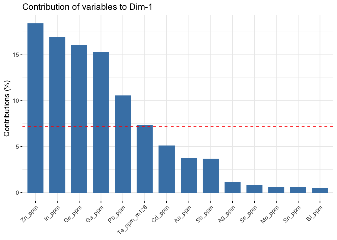

``` r
knitr::opts_chunk$set(
  warning = FALSE, # show warnings
  message = TRUE, # show messages
  error = TRUE, # do not interrupt generation in case of errors,
  echo = TRUE  # show R code
)
```

# Geological visualization of elements

The aim of this folder is to…. create a grouped box and whisker plot
with the ggplot2 package for visualization of a variety of trace element
concentrations in different forms of Carrollite in the central African
Copperbelt, then a principle component analysis on the different styles
of mineralization

load packages in R

``` r
library(ggplot2) 
pacman::p_load(tidyverse)
library(wesanderson)
library(FactoMineR)
library(factoextra)
```

    ## Welcome! Want to learn more? See two factoextra-related books at https://goo.gl/ve3WBa

The use of ggplots2 to create the box and whisker The grouped plots that
will be used to test the geological data

loading the excel data via clipboard this will not work without it being
copied\!\!

``` r
# copying the data in 

#CarDissem <- read.table(pipe("pbpaste"), sep="\t", header = TRUE)

#CarCross <- read.table(pipe("pbpaste"), sep="\t", header = TRUE)

#CarJack <- read.table(pipe("pbpaste"), sep="\t", header = TRUE)

# moving it to csv files for the knit function

#write.csv(combination,"/Users/charlesrandell/Other/Random projects/Box and Whisker/data/Combination.csv", row.names = FALSE)

#write.csv(CarDissem,"/Users/charlesrandell/Other/Random projects/Box and Whisker/data/CarDissem.csv", row.names = FALSE)

#write.csv(CarCross,"/Users/charlesrandell/Other/Random projects/Box and Whisker/data/CarCross.csv", row.names = FALSE)

#write.csv(CarJack,"/Users/charlesrandell/Other/Random projects/Box and Whisker/data/CarJack.csv", row.names = FALSE)

setwd("/Users/charlesrandell/Other/Random projects/Box and Whisker/data")

CarStrat <- read.csv("CarStrat.csv", header = TRUE)

CarDissem <- read.csv("CarDissem.csv", header = TRUE)

CarCross <- read.csv("CarCross.csv", header = TRUE)

CarJack <- read.csv("CarJack.csv", header = TRUE)

combination <- read.csv("Combination.csv", header = TRUE)
```

## Tidyr

Lets see what happens… Changing the data imported in wide format into a
long tidy format

``` r
TidyCarCross <- CarCross %>% tidyr::gather(Header, val)

TidyCarDissem <- CarDissem %>% tidyr::gather(Header, val)

TidyCarStrat <- CarStrat  %>% tidyr::gather(Header, val)

TidyCarJack <- CarJack  %>% tidyr::gather(Header, val)
```

## dplyr

This creates the new variable that has the extra column with the added
indicator to be merged to the final dataset. The use of the tidyverse to
convert the data into a long format rather that a wide so that ggplot2
can create the boxplot with it

``` r
Tcarcross <- TidyCarCross %>% mutate(Classes = "4CarCross")

Tcardissem <- TidyCarDissem %>% mutate(Classes = "2CarDissem")

Tcarstrat <- TidyCarStrat %>% mutate(Classes = "1CarStrat")

Tcarjack <- TidyCarJack %>% mutate(Classes = "3CarJack")
```

## binding and filtering the data

Bind the datasets together Secondly the readings that are below the
detectable level are filtered out

``` r
Final <- rbind.data.frame(Tcarstrat, Tcardissem, Tcarcross, Tcarjack)
Final <- Final %>% filter(val != "Below LOD")
Final <- Final %>% filter(Header != "Te_ppm_m125")
```

## gsub to format elements

mutate function that can remove certain phrases within values in a
column

``` r
Final <- Final %>% mutate(Header = gsub("_ppm", "", Header))
Final <- Final %>% mutate(Header = gsub("_m126", "", Header))
```

Convert the variable Classes and Header from a character to a factor
variable Convert the value variable from a character to a numerical
variable - this is very important and the code will not run without it

``` r
Final[, 'Classes'] <- as.factor(Final[, 'Classes'])
Final[, 'val'] <- as.numeric(Final[, 'val'])
Final[, 'Header'] <- as.factor(Final[, 'Header'])
```

Firstly the outliers are removed, any value that exceeds 150 is taked
out

``` r
Final <- Final %>% filter(val < 150)
```

## ggplot to create graphs

The plot is constructed using ggplot, with two iterations of the same
graph, the first shows the raw output on a linear scale And second has a
log scale y axis, along with updated labels and different colour palette

``` r
# The Main ggplot

sfplot <- ggplot(Final, aes(x=Header, y=val, fill=Classes)) + 
    geom_boxplot(outlier.size = 0.01) + stat_summary(fun = mean, shape = 4, aes(group=Classes), position=position_dodge(0.75), show.legend = FALSE, color="black", size=0.25)

sfplot
```

<!-- -->

``` r
# For some reason this is what worked for the color codes to range from 2-5

wes1 <- wes_palette("FantasticFox1")[2:5]
roy2 <- wes_palette("Royal2")[1:3]


# The Final Wes Anderson themed plot

sfplot  +
coord_trans(y = "log") + scale_y_continuous(breaks = c(0.01, 0.1, 1, 10, 100), labels = c(0.01, 0.1, 1, 10, 100)) + labs(x="Elements", y = "Log (Concentrations) / ppm") + theme(legend.position="bottom") + scale_fill_manual(guide = guide_legend(title = ""), breaks=c("1CarStrat", "2CarDissem", "3CarJack", "4CarCross"), values=c(wes1), labels=c("Stratiform Carrollite", "Disseminated Carrollite", "Jack Vein Carrollite", "Cross-Cutting Vein Carrollite")) + theme(axis.text.x = element_text(size=12, face = "bold"), axis.text.y = element_text(size=12, face = "bold"), legend.text=element_text(size=14), axis.title=element_text(size=15,face="bold"))
```

<!-- -->

## t tests

``` r
CarCross <- mutate_all(CarCross, function(x) as.numeric(as.character(x)))
CarDissem <- mutate_all(CarDissem, function(x) as.numeric(as.character(x)))
CarJack <- mutate_all(CarJack, function(x) as.numeric(as.character(x)))
CarStrat <- mutate_all(CarStrat, function(x) as.numeric(as.character(x)))

combination <- mutate_all(combination, function(x) as.numeric(as.character(x)))

CarCross[is.na(CarCross)] <- 0
combination[is.na(combination)] <- 0

t.test(CarCross$Zn_ppm, combination$Zn_ppm)
```

    ## 
    ##  Welch Two Sample t-test
    ## 
    ## data:  CarCross$Zn_ppm and combination$Zn_ppm
    ## t = 2.3796, df = 34.957, p-value = 0.02292
    ## alternative hypothesis: true difference in means is not equal to 0
    ## 95 percent confidence interval:
    ##   1.700024 21.454587
    ## sample estimates:
    ## mean of x mean of y 
    ##  16.61388   5.03657

``` r
confidence_interval <- function(vector, interval) {
  # Standard deviation of sample
  vec_sd <- sd(vector)
  # Sample size
  n <- length(vector)
  # Mean of sample
  vec_mean <- mean(vector)
  # Error according to t distribution
  error <- qt((interval + 1)/2, df = n - 1) * vec_sd / sqrt(n)
  # Confidence interval as a vector
  result <- c("lower" = vec_mean - error, "upper" = vec_mean + error)
  return(result)
}
```

# pca

This section will perform a principle component analysis on the all of
the grouped data with the “Below LOD” reduced to zero, and an
identification style attached to each dataset.

``` r
CarStrat$Classes <- 'CarStrat'
CarCross$Classes <- "CarCross"
CarDissem$Classes <- "CarDissem"
CarJack$Classes <- "CarJack"

pcat <- rbind(CarStrat, CarCross, CarDissem, CarJack)
pcat[, 'Classes'] <- as.factor(pcat[, 'Classes'])

car.pca <- PCA(pcat %>% select(-Classes), graph = FALSE)

pcat[is.na(pcat)] <- 0


fviz_pca_biplot(car.pca, habillage = pcat$Classes, addEllipses = TRUE, 
    col.var = "red", alpha.var = "cos2", label = "var") + scale_color_brewer(palette = "Dark2") + 
    theme_minimal()
```

<!-- -->
