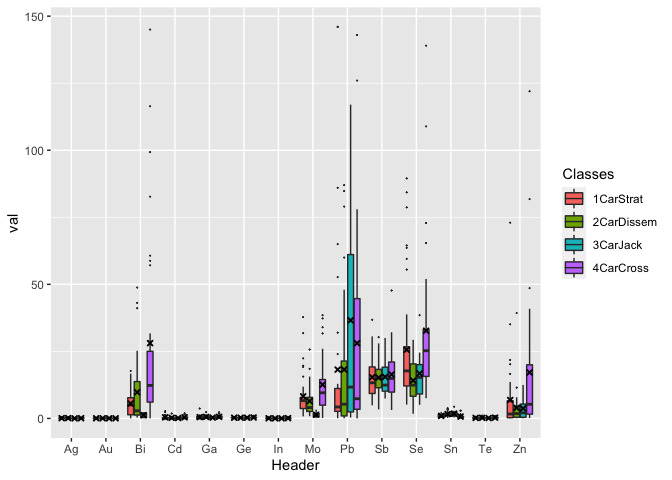
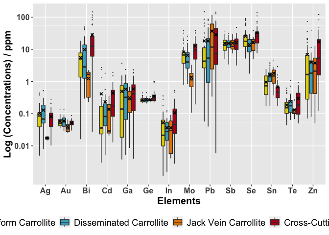
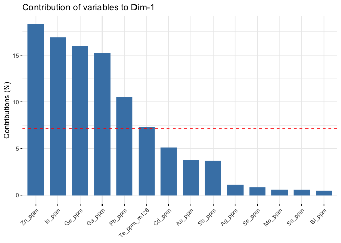
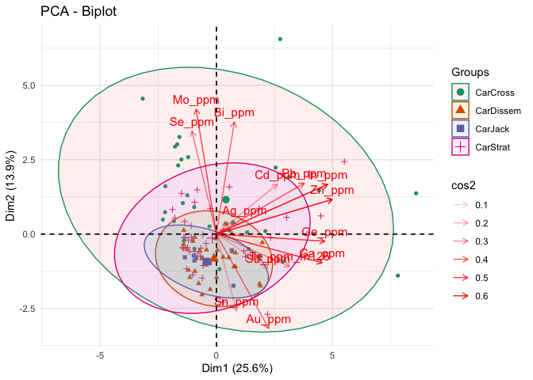

``` r
knitr::opts_chunk$set(
  warning = FALSE, # show warnings
  message = TRUE, # show messages
  error = TRUE, # do not interrupt generation in case of errors,
  echo = TRUE  # show R code
)
```

# Geology masters code

The aim of this folder is to…. statistically and graphically observe the
differences in a variety of trace element concentrations in different
forms of Carrollite in the central African Copperbelt, then a principle
component analysis on the different styles of mineralization

load packages in R

``` r
library(ggplot2) 
pacman::p_load(tidyverse)
library(wesanderson)
library(FactoMineR)
library(factoextra)
```

    ## Welcome! Want to learn more? See two factoextra-related books at https://goo.gl/ve3WBa

The use of ggplots2 to create the box and whisker The grouped plots that
will be used to test the geological data

loading the excel data via clipboard this will not work without it being
copied\!\!

``` r
# This is just an easy way of copying in the data and then once local storage is required the write.csv can 
# be used so that the data can be knitted
#Car8 <- read.table(pipe("pbpaste"), sep="\t", header = TRUE)
# moving it to csv files for the knit function
#write.csv(Car8,"/Users/charlesrandell/Other/Random projects/Box and Whisker/data/Car8.csv", row.names = FALSE)

setwd("/Users/charlesrandell/Other/Random projects/Box and Whisker/data")

CarStrat <- read.csv("CarStrat.csv", header = TRUE)

CarDissem <- read.csv("CarDissem.csv", header = TRUE)

CarCross <- read.csv("CarCross.csv", header = TRUE)

CarJack <- read.csv("CarJack.csv", header = TRUE)

combination <- read.csv("Combination.csv", header = TRUE)

Chal88 <- read.csv("Chal88.csv", header = TRUE)

Chal8 <- read.csv("Chal8.csv", header = TRUE)

Car88 <- read.csv("Car8.csv", header = TRUE)

Car8 <- read.csv("Car88.csv", header = TRUE)
```

## Tidyr

Lets see what happens… Changing the data imported in wide format into a
long tidy format

``` r
TidyCarCross <- CarCross %>% tidyr::gather(Header, val)

TidyCarDissem <- CarDissem %>% tidyr::gather(Header, val)

TidyCarStrat <- CarStrat  %>% tidyr::gather(Header, val)

TidyCarJack <- CarJack  %>% tidyr::gather(Header, val)
```

## dplyr

This creates the new variable that has the extra column with the added
indicator to be merged to the final dataset. The use of the tidyverse to
convert the data into a long format rather that a wide so that ggplot2
can create the boxplot with it

``` r
Tcarcross <- TidyCarCross %>% mutate(Classes = "4CarCross")

Tcardissem <- TidyCarDissem %>% mutate(Classes = "2CarDissem")

Tcarstrat <- TidyCarStrat %>% mutate(Classes = "1CarStrat")

Tcarjack <- TidyCarJack %>% mutate(Classes = "3CarJack")
```

## binding and filtering the data

Bind the datasets together Secondly the readings that are below the
detectable level are filtered out

``` r
Final <- rbind.data.frame(Tcarstrat, Tcardissem, Tcarcross, Tcarjack)
Final <- Final %>% filter(val != "Below LOD")
Final <- Final %>% filter(Header != "Te_ppm_m125")
```

## gsub to format elements

mutate function that can remove certain phrases within values in a
column

``` r
Final <- Final %>% mutate(Header = gsub("_ppm", "", Header))
Final <- Final %>% mutate(Header = gsub("_m126", "", Header))
```

Convert the variable Classes and Header from a character to a factor
variable Convert the value variable from a character to a numerical
variable - this is very important and the code will not run without it

``` r
Final[, 'Classes'] <- as.factor(Final[, 'Classes'])
Final[, 'val'] <- as.numeric(Final[, 'val'])
Final[, 'Header'] <- as.factor(Final[, 'Header'])
```

Firstly the outliers are removed, any value that exceeds 150 is taked
out

``` r
Final <- Final %>% filter(val < 150)
```

## ggplot to create graphs

The plot is constructed using ggplot, with two iterations of the same
graph, the first shows the raw output on a linear scale And second has a
log scale y axis, along with updated labels and different colour palette

``` r
# The Main ggplot

sfplot <- ggplot(Final, aes(x=Header, y=val, fill=Classes)) + 
    geom_boxplot(outlier.size = 0.01) + stat_summary(fun = mean, shape = 4, aes(group=Classes), position=position_dodge(0.75), show.legend = FALSE, color="black", size=0.25)

sfplot
```

<!-- -->

``` r
# For some reason this is what worked for the color codes to range from 2-5

wes1 <- wes_palette("FantasticFox1")[2:5]
roy2 <- wes_palette("Royal2")[1:3]


# The Final Wes Anderson themed plot

sfplot  +
coord_trans(y = "log") + scale_y_continuous(breaks = c(0.01, 0.1, 1, 10, 100), labels = c(0.01, 0.1, 1, 10, 100)) + labs(x="Elements", y = "Log (Concentrations) / ppm") + theme(legend.position="bottom") + scale_fill_manual(guide = guide_legend(title = ""), breaks=c("1CarStrat", "2CarDissem", "3CarJack", "4CarCross"), values=c(wes1), labels=c("Stratiform Carrollite", "Disseminated Carrollite", "Jack Vein Carrollite", "Cross-Cutting Vein Carrollite")) + theme(axis.text.x = element_text(size=12, face = "bold"), axis.text.y = element_text(size=12, face = "bold"), legend.text=element_text(size=14), axis.title=element_text(size=15,face="bold"))
```

<!-- -->

## t tests

``` r
CarCross <- mutate_all(CarCross, function(x) as.numeric(as.character(x)))
CarDissem <- mutate_all(CarDissem, function(x) as.numeric(as.character(x)))
CarJack <- mutate_all(CarJack, function(x) as.numeric(as.character(x)))
CarStrat <- mutate_all(CarStrat, function(x) as.numeric(as.character(x)))


myfunc <-function(x) { 
  x %>%
    mutate_all(function(x) as.numeric(as.character(x)))
}

# apply function to make all numeric

Car8 <- myfunc(Car8)
Car88 <- myfunc(Car88)
Chal8 <- myfunc(Chal8)
Chal88 <- myfunc(Chal88)


# make the nas zero

Car8[is.na(Car8)] <- 0
Car88[is.na(Car88)] <- 0
Chal8[is.na(Chal8)] <- 0
Chal88[is.na(Chal88)] <- 0

# apply function to all datasets 

combination <- mutate_all(combination, function(x) as.numeric(as.character(x)))

CarCross[is.na(CarCross)] <- 0
combination[is.na(combination)] <- 0

t.test(CarCross$Zn_ppm, combination$Zn_ppm)
```

    ## 
    ##  Welch Two Sample t-test
    ## 
    ## data:  CarCross$Zn_ppm and combination$Zn_ppm
    ## t = 2.3796, df = 34.957, p-value = 0.02292
    ## alternative hypothesis: true difference in means is not equal to 0
    ## 95 percent confidence interval:
    ##   1.700024 21.454587
    ## sample estimates:
    ## mean of x mean of y 
    ##  16.61388   5.03657

``` r
t.test(CarCross$Te_ppm, combination$Te_ppm)
```

    ## 
    ##  Welch Two Sample t-test
    ## 
    ## data:  CarCross$Te_ppm and combination$Te_ppm
    ## t = 0.24777, df = 42.736, p-value = 0.8055
    ## alternative hypothesis: true difference in means is not equal to 0
    ## 95 percent confidence interval:
    ##  -0.08807555  0.11274328
    ## sample estimates:
    ## mean of x mean of y 
    ## 0.1866250 0.1742911

``` r
t.test(CarCross$Sn_ppm, combination$Sn_ppm)
```

    ## 
    ##  Welch Two Sample t-test
    ## 
    ## data:  CarCross$Sn_ppm and combination$Sn_ppm
    ## t = -3.9063, df = 79.128, p-value = 0.0001963
    ## alternative hypothesis: true difference in means is not equal to 0
    ## 95 percent confidence interval:
    ##  -0.9180788 -0.2982883
    ## sample estimates:
    ## mean of x mean of y 
    ##  0.675500  1.283684

``` r
t.test(CarCross$Se_ppm, combination$Se_ppm)
```

    ## 
    ##  Welch Two Sample t-test
    ## 
    ## data:  CarCross$Se_ppm and combination$Se_ppm
    ## t = 2.2612, df = 41.412, p-value = 0.02906
    ## alternative hypothesis: true difference in means is not equal to 0
    ## 95 percent confidence interval:
    ##   1.31094 23.15844
    ## sample estimates:
    ## mean of x mean of y 
    ##  32.70469  20.47000

``` r
t.test(CarCross$Sb_ppm, combination$Sb_ppm)
```

    ## 
    ##  Welch Two Sample t-test
    ## 
    ## data:  CarCross$Sb_ppm and combination$Sb_ppm
    ## t = 0.58141, df = 47.478, p-value = 0.5637
    ## alternative hypothesis: true difference in means is not equal to 0
    ## 95 percent confidence interval:
    ##  -2.614152  4.740165
    ## sample estimates:
    ## mean of x mean of y 
    ##  16.39997  15.33696

``` r
t.test(CarCross$Pb_ppm, combination$Pb_ppm)
```

    ## 
    ##  Welch Two Sample t-test
    ## 
    ## data:  CarCross$Pb_ppm and combination$Pb_ppm
    ## t = 0.55339, df = 76.619, p-value = 0.5816
    ## alternative hypothesis: true difference in means is not equal to 0
    ## 95 percent confidence interval:
    ##  -12.3587  21.8707
    ## sample estimates:
    ## mean of x mean of y 
    ##  28.05003  23.29403

``` r
t.test(CarCross$Mo_ppm, combination$Mo_ppm)
```

    ## 
    ##  Welch Two Sample t-test
    ## 
    ## data:  CarCross$Mo_ppm and combination$Mo_ppm
    ## t = 2.6768, df = 41.345, p-value = 0.01061
    ## alternative hypothesis: true difference in means is not equal to 0
    ## 95 percent confidence interval:
    ##  1.386401 9.897097
    ## sample estimates:
    ## mean of x mean of y 
    ## 12.593813  6.952063

``` r
t.test(CarCross$In_ppm, combination$In_ppm)
```

    ## 
    ##  Welch Two Sample t-test
    ## 
    ## data:  CarCross$In_ppm and combination$In_ppm
    ## t = 2.4922, df = 35.887, p-value = 0.01745
    ## alternative hypothesis: true difference in means is not equal to 0
    ## 95 percent confidence interval:
    ##  0.01123388 0.10947324
    ## sample estimates:
    ##  mean of x  mean of y 
    ## 0.10411875 0.04376519

``` r
t.test(CarCross$Ge_ppm, combination$Ge_ppm)
```

    ## 
    ##  Welch Two Sample t-test
    ## 
    ## data:  CarCross$Ge_ppm and combination$Ge_ppm
    ## t = 2.6741, df = 32.87, p-value = 0.01158
    ## alternative hypothesis: true difference in means is not equal to 0
    ## 95 percent confidence interval:
    ##  0.02003699 0.14760146
    ## sample estimates:
    ## mean of x mean of y 
    ## 0.3537812 0.2699620

``` r
t.test(CarCross$Ga_ppm, combination$Ga_ppm)
```

    ## 
    ##  Welch Two Sample t-test
    ## 
    ## data:  CarCross$Ga_ppm and combination$Ga_ppm
    ## t = 0.95812, df = 58.932, p-value = 0.3419
    ## alternative hypothesis: true difference in means is not equal to 0
    ## 95 percent confidence interval:
    ##  -0.1360807  0.3861135
    ## sample estimates:
    ## mean of x mean of y 
    ## 0.5521063 0.4270899

``` r
t.test(CarCross$Cd_ppm, combination$Cd_ppm)
```

    ## 
    ##  Welch Two Sample t-test
    ## 
    ## data:  CarCross$Cd_ppm and combination$Cd_ppm
    ## t = 0.70096, df = 59.531, p-value = 0.4861
    ## alternative hypothesis: true difference in means is not equal to 0
    ## 95 percent confidence interval:
    ##  -0.1251565  0.2601614
    ## sample estimates:
    ## mean of x mean of y 
    ## 0.2174062 0.1499038

``` r
t.test(CarCross$Bi_ppm, combination$Bi_ppm)
```

    ## 
    ##  Welch Two Sample t-test
    ## 
    ## data:  CarCross$Bi_ppm and combination$Bi_ppm
    ## t = 3.2645, df = 32.68, p-value = 0.002574
    ## alternative hypothesis: true difference in means is not equal to 0
    ## 95 percent confidence interval:
    ##   8.017254 34.566371
    ## sample estimates:
    ## mean of x mean of y 
    ## 28.080541  6.788728

``` r
t.test(CarCross$Au_ppm, combination$Au_ppm)
```

    ## 
    ##  Welch Two Sample t-test
    ## 
    ## data:  CarCross$Au_ppm and combination$Au_ppm
    ## t = -0.86177, df = 70.535, p-value = 0.3917
    ## alternative hypothesis: true difference in means is not equal to 0
    ## 95 percent confidence interval:
    ##  -0.01736332  0.00688468
    ## sample estimates:
    ##  mean of x  mean of y 
    ## 0.03340625 0.03864557

``` r
t.test(CarCross$Ag_ppm, combination$Ag_ppm)
```

    ## 
    ##  Welch Two Sample t-test
    ## 
    ## data:  CarCross$Ag_ppm and combination$Ag_ppm
    ## t = -0.048197, df = 95.661, p-value = 0.9617
    ## alternative hypothesis: true difference in means is not equal to 0
    ## 95 percent confidence interval:
    ##  -0.03159172  0.03009402
    ## sample estimates:
    ##  mean of x  mean of y 
    ## 0.07960937 0.08035823

``` r
confidence_interval <- function(vector, interval) {
  # Standard deviation of sample
  vec_sd <- sd(vector)
  # Sample size
  n <- length(vector)
  # Mean of sample
  vec_mean <- mean(vector)
  # Error according to t distribution
  error <- qt((interval + 1)/2, df = n - 1) * vec_sd / sqrt(n)
  # Confidence interval as a vector
  result <- c("lower" = vec_mean - error, "upper" = vec_mean + error)
  return(result)
}
```

## t test for second dataset Car

``` r
t.test(Chal8$Zn_ppm, Car88$Zn_ppm)
```

    ## 
    ##  Welch Two Sample t-test
    ## 
    ## data:  Chal8$Zn_ppm and Car88$Zn_ppm
    ## t = 8.2067, df = 32.995, p-value = 1.783e-09
    ## alternative hypothesis: true difference in means is not equal to 0
    ## 95 percent confidence interval:
    ##  12.12457 20.11776
    ## sample estimates:
    ## mean of x mean of y 
    ## 18.014063  1.892895

``` r
t.test(Car8$Te_ppm, Car88$Te_ppm)
```

    ## 
    ##  Welch Two Sample t-test
    ## 
    ## data:  Car8$Te_ppm and Car88$Te_ppm
    ## t = 8.2686, df = 73.51, p-value = 4.203e-12
    ## alternative hypothesis: true difference in means is not equal to 0
    ## 95 percent confidence interval:
    ##  0.1338973 0.2189302
    ## sample estimates:
    ##   mean of x   mean of y 
    ## 0.180361111 0.003947368

``` r
t.test(Car8$Sn_ppm, Car88$Sn_ppm)
```

    ## 
    ##  Welch Two Sample t-test
    ## 
    ## data:  Car8$Sn_ppm and Car88$Sn_ppm
    ## t = 4.03, df = 31.386, p-value = 0.0003304
    ## alternative hypothesis: true difference in means is not equal to 0
    ## 95 percent confidence interval:
    ##  0.3980359 1.2128965
    ## sample estimates:
    ## mean of x mean of y 
    ## 1.2342083 0.4287421

``` r
t.test(Car8$Se_ppm, Car88$Se_ppm)
```

    ## 
    ##  Welch Two Sample t-test
    ## 
    ## data:  Car8$Se_ppm and Car88$Se_ppm
    ## t = 1.837, df = 30.522, p-value = 0.07597
    ## alternative hypothesis: true difference in means is not equal to 0
    ## 95 percent confidence interval:
    ##  -0.9024073 17.1675681
    ## sample estimates:
    ## mean of x mean of y 
    ##  20.83153  12.69895

``` r
t.test(Car8$Sb_ppm, Car88$Sb_ppm)
```

    ## 
    ##  Welch Two Sample t-test
    ## 
    ## data:  Car8$Sb_ppm and Car88$Sb_ppm
    ## t = 1.6771, df = 19.863, p-value = 0.1092
    ## alternative hypothesis: true difference in means is not equal to 0
    ## 95 percent confidence interval:
    ##  -1.597506 14.672313
    ## sample estimates:
    ## mean of x mean of y 
    ## 15.321667  8.784263

``` r
t.test(Car8$Pb_ppm, Car88$Pb_ppm)
```

    ## 
    ##  Welch Two Sample t-test
    ## 
    ## data:  Car8$Pb_ppm and Car88$Pb_ppm
    ## t = -0.06109, df = 30.105, p-value = 0.9517
    ## alternative hypothesis: true difference in means is not equal to 0
    ## 95 percent confidence interval:
    ##  -25.28351  23.81462
    ## sample estimates:
    ## mean of x mean of y 
    ##  22.00150  22.73595

``` r
t.test(Car8$Mo_ppm, Car88$Mo_ppm)
```

    ## 
    ##  Welch Two Sample t-test
    ## 
    ## data:  Car8$Mo_ppm and Car88$Mo_ppm
    ## t = 4.9934, df = 67.18, p-value = 4.469e-06
    ## alternative hypothesis: true difference in means is not equal to 0
    ## 95 percent confidence interval:
    ##  3.309042 7.715746
    ## sample estimates:
    ## mean of x mean of y 
    ##  7.496083  1.983689

``` r
t.test(Car8$In_ppm, Car88$In_ppm)
```

    ## 
    ##  Welch Two Sample t-test
    ## 
    ## data:  Car8$In_ppm and Car88$In_ppm
    ## t = -0.74493, df = 18.239, p-value = 0.4658
    ## alternative hypothesis: true difference in means is not equal to 0
    ## 95 percent confidence interval:
    ##  -0.2450851  0.1166889
    ## sample estimates:
    ##  mean of x  mean of y 
    ## 0.04446875 0.10866684

``` r
t.test(Car8$Ge_ppm, Car88$Ge_ppm)
```

    ## 
    ##  Welch Two Sample t-test
    ## 
    ## data:  Car8$Ge_ppm and Car88$Ge_ppm
    ## t = -8.4696, df = 18.053, p-value = 1.054e-07
    ## alternative hypothesis: true difference in means is not equal to 0
    ## 95 percent confidence interval:
    ##  -1.5865630 -0.9559984
    ## sample estimates:
    ## mean of x mean of y 
    ## 0.2696667 1.5409474

``` r
t.test(Car8$Ga_ppm, Car88$Ga_ppm)
```

    ## 
    ##  Welch Two Sample t-test
    ## 
    ## data:  Car8$Ga_ppm and Car88$Ga_ppm
    ## t = 0.93733, df = 30.691, p-value = 0.3559
    ## alternative hypothesis: true difference in means is not equal to 0
    ## 95 percent confidence interval:
    ##  -0.1733037  0.4678481
    ## sample estimates:
    ## mean of x mean of y 
    ## 0.4426722 0.2954000

``` r
t.test(Car8$Cd_ppm, Car88$Cd_ppm)
```

    ## 
    ##  Welch Two Sample t-test
    ## 
    ## data:  Car8$Cd_ppm and Car88$Cd_ppm
    ## t = 2.2612, df = 74.957, p-value = 0.02665
    ## alternative hypothesis: true difference in means is not equal to 0
    ## 95 percent confidence interval:
    ##  0.01584533 0.25044765
    ## sample estimates:
    ##  mean of x  mean of y 
    ## 0.15878333 0.02563684

``` r
t.test(Car8$Bi_ppm, Car88$Bi_ppm)
```

    ## 
    ##  Welch Two Sample t-test
    ## 
    ## data:  Car8$Bi_ppm and Car88$Bi_ppm
    ## t = 2.9851, df = 88.428, p-value = 0.003666
    ## alternative hypothesis: true difference in means is not equal to 0
    ## 95 percent confidence interval:
    ##  1.246627 6.211266
    ## sample estimates:
    ## mean of x mean of y 
    ##  7.328215  3.599268

``` r
t.test(Car8$Au_ppm, Car88$Au_ppm)
```

    ## 
    ##  Welch Two Sample t-test
    ## 
    ## data:  Car8$Au_ppm and Car88$Au_ppm
    ## t = 5.1269, df = 67.525, p-value = 2.669e-06
    ## alternative hypothesis: true difference in means is not equal to 0
    ## 95 percent confidence interval:
    ##  0.01653464 0.03761214
    ## sample estimates:
    ##  mean of x  mean of y 
    ## 0.04019444 0.01312105

``` r
t.test(Car8$Ag_ppm, Car88$Ag_ppm)
```

    ## 
    ##  Welch Two Sample t-test
    ## 
    ## data:  Car8$Ag_ppm and Car88$Ag_ppm
    ## t = 6.4337, df = 74.927, p-value = 1.052e-08
    ## alternative hypothesis: true difference in means is not equal to 0
    ## 95 percent confidence interval:
    ##  0.05528976 0.10488743
    ## sample estimates:
    ##   mean of x   mean of y 
    ## 0.087683333 0.007594737

## t test for third dataset Chal

``` r
t.test(Chal8$Zn_ppm, Chal88$Zn_ppm)
```

    ## 
    ##  Welch Two Sample t-test
    ## 
    ## data:  Chal8$Zn_ppm and Chal88$Zn_ppm
    ## t = 1.1856, df = 30.794, p-value = 0.2449
    ## alternative hypothesis: true difference in means is not equal to 0
    ## 95 percent confidence interval:
    ##  -2.939335 11.095695
    ## sample estimates:
    ## mean of x mean of y 
    ##  18.01406  13.93588

``` r
t.test(Chal8$Te_ppm, Chal88$Te_ppm)
```

    ## 
    ##  Welch Two Sample t-test
    ## 
    ## data:  Chal8$Te_ppm and Chal88$Te_ppm
    ## t = -2.2455, df = 16.008, p-value = 0.03921
    ## alternative hypothesis: true difference in means is not equal to 0
    ## 95 percent confidence interval:
    ##  -0.61395197 -0.01768038
    ## sample estimates:
    ## mean of x mean of y 
    ## 0.0031250 0.3189412

``` r
t.test(Chal8$Sn_ppm, Chal88$Sn_ppm)
```

    ## 
    ##  Welch Two Sample t-test
    ## 
    ## data:  Chal8$Sn_ppm and Chal88$Sn_ppm
    ## t = -1.5947, df = 26.813, p-value = 0.1225
    ## alternative hypothesis: true difference in means is not equal to 0
    ## 95 percent confidence interval:
    ##  -5.109950  0.641457
    ## sample estimates:
    ## mean of x mean of y 
    ##  4.432812  6.667059

``` r
t.test(Chal8$Se_ppm, Chal88$Se_ppm)
```

    ## 
    ##  Welch Two Sample t-test
    ## 
    ## data:  Chal8$Se_ppm and Chal88$Se_ppm
    ## t = -1.5085, df = 40.127, p-value = 0.1393
    ## alternative hypothesis: true difference in means is not equal to 0
    ## 95 percent confidence interval:
    ##  -11.641370   1.690157
    ## sample estimates:
    ## mean of x mean of y 
    ##  14.94969  19.92529

``` r
t.test(Chal8$Sb_ppm, Chal88$Sb_ppm)
```

    ## 
    ##  Welch Two Sample t-test
    ## 
    ## data:  Chal8$Sb_ppm and Chal88$Sb_ppm
    ## t = -1.6221, df = 16.22, p-value = 0.124
    ## alternative hypothesis: true difference in means is not equal to 0
    ## 95 percent confidence interval:
    ##  -3.0759899  0.4075031
    ## sample estimates:
    ## mean of x mean of y 
    ## 0.8840625 2.2183059

``` r
t.test(Chal8$Pb_ppm, Chal88$Pb_ppm)
```

    ## 
    ##  Welch Two Sample t-test
    ## 
    ## data:  Chal8$Pb_ppm and Chal88$Pb_ppm
    ## t = 2.0589, df = 40.55, p-value = 0.04597
    ## alternative hypothesis: true difference in means is not equal to 0
    ## 95 percent confidence interval:
    ##   0.2628433 27.7258699
    ## sample estimates:
    ## mean of x mean of y 
    ##  35.01906  21.02471

``` r
t.test(Chal8$Mo_ppm, Chal88$Mo_ppm)
```

    ## 
    ##  Welch Two Sample t-test
    ## 
    ## data:  Chal8$Mo_ppm and Chal88$Mo_ppm
    ## t = -1.69, df = 18.247, p-value = 0.108
    ## alternative hypothesis: true difference in means is not equal to 0
    ## 95 percent confidence interval:
    ##  -0.64390391  0.06948479
    ## sample estimates:
    ## mean of x mean of y 
    ## 0.1534375 0.4406471

``` r
t.test(Chal8$In_ppm, Chal88$In_ppm)
```

    ## 
    ##  Welch Two Sample t-test
    ## 
    ## data:  Chal8$In_ppm and Chal88$In_ppm
    ## t = -9.6405, df = 17.011, p-value = 2.625e-08
    ## alternative hypothesis: true difference in means is not equal to 0
    ## 95 percent confidence interval:
    ##  -10.624412  -6.809264
    ## sample estimates:
    ## mean of x mean of y 
    ##   2.71375  11.43059

``` r
t.test(Chal8$Ge_ppm, Chal88$Ge_ppm)
```

    ## 
    ##  Welch Two Sample t-test
    ## 
    ## data:  Chal8$Ge_ppm and Chal88$Ge_ppm
    ## t = -3.0484, df = 28.847, p-value = 0.004888
    ## alternative hypothesis: true difference in means is not equal to 0
    ## 95 percent confidence interval:
    ##  -1.5000510 -0.2952726
    ## sample estimates:
    ## mean of x mean of y 
    ##  2.123750  3.021412

``` r
t.test(Chal8$Ga_ppm, Chal88$Ga_ppm)
```

    ## 
    ##  Welch Two Sample t-test
    ## 
    ## data:  Chal8$Ga_ppm and Chal88$Ga_ppm
    ## t = 1.5917, df = 34.084, p-value = 0.1207
    ## alternative hypothesis: true difference in means is not equal to 0
    ## 95 percent confidence interval:
    ##  -0.192162  1.581405
    ## sample estimates:
    ## mean of x mean of y 
    ##  2.606562  1.911941

``` r
t.test(Chal8$Cd_ppm, Chal88$Cd_ppm)
```

    ## 
    ##  Welch Two Sample t-test
    ## 
    ## data:  Chal8$Cd_ppm and Chal88$Cd_ppm
    ## t = 2.0328, df = 31.789, p-value = 0.05049
    ## alternative hypothesis: true difference in means is not equal to 0
    ## 95 percent confidence interval:
    ##  -0.0007022755  0.6146213932
    ## sample estimates:
    ##  mean of x  mean of y 
    ## 0.37531250 0.06835294

``` r
t.test(Chal8$Bi_ppm, Chal88$Bi_ppm)
```

    ## 
    ##  Welch Two Sample t-test
    ## 
    ## data:  Chal8$Bi_ppm and Chal88$Bi_ppm
    ## t = -3.3544, df = 16.732, p-value = 0.003829
    ## alternative hypothesis: true difference in means is not equal to 0
    ## 95 percent confidence interval:
    ##  -40.066960  -9.102988
    ## sample estimates:
    ## mean of x mean of y 
    ##  5.323437 29.908412

``` r
t.test(Chal8$Au_ppm, Chal88$Au_ppm)
```

    ## 
    ##  Welch Two Sample t-test
    ## 
    ## data:  Chal8$Au_ppm and Chal88$Au_ppm
    ## t = -1.7431, df = 34.535, p-value = 0.09022
    ## alternative hypothesis: true difference in means is not equal to 0
    ## 95 percent confidence interval:
    ##  -0.047046167  0.003590284
    ## sample estimates:
    ##  mean of x  mean of y 
    ## 0.01562500 0.03735294

``` r
t.test(Chal8$Ag_ppm, Chal88$Ag_ppm)
```

    ## 
    ##  Welch Two Sample t-test
    ## 
    ## data:  Chal8$Ag_ppm and Chal88$Ag_ppm
    ## t = -0.51159, df = 36.504, p-value = 0.612
    ## alternative hypothesis: true difference in means is not equal to 0
    ## 95 percent confidence interval:
    ##  -0.1693646  0.1011058
    ## sample estimates:
    ## mean of x mean of y 
    ## 0.0750000 0.1091294

# pca

This section will perform a principle component analysis on the all of
the grouped data with the “Below LOD” reduced to zero, and an
identification style attached to each dataset.

``` r
CarStrat$Classes <- 'CarStrat'
CarCross$Classes <- "CarCross"
CarDissem$Classes <- "CarDissem"
CarJack$Classes <- "CarJack"

pcat <- rbind(CarStrat, CarCross, CarDissem, CarJack)
pcat[, 'Classes'] <- as.factor(pcat[, 'Classes'])

car.pca <- PCA(pcat %>% select(-Classes), graph = FALSE)

pcat[is.na(pcat)] <- 0

fviz_contrib(car.pca, choice = "var", axes = 1)
```

<!-- -->

``` r
fviz_pca_biplot(car.pca, habillage = pcat$Classes, addEllipses = TRUE, 
    col.var = "red", alpha.var = "cos2", label = "var") + scale_color_brewer(palette = "Dark2") + 
    theme_minimal()
```

<!-- -->
